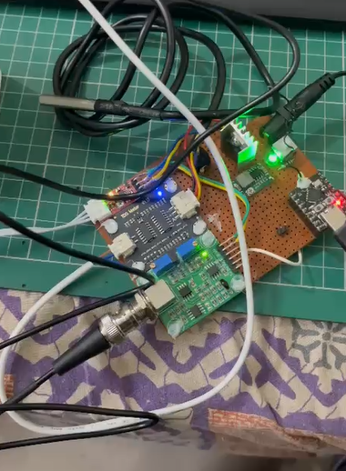

# Agricultural Wastewater Quality Monitoring System

## 📌 Overview
This project monitors water quality using pH, TDS, turbidity, and temperature sensors with ESP32.

## 🎯 Objective
To provide a low-cost real-time system for agriculture.

## ⚙️ Components
- ESP32
- pH sensor
- TDS sensor
- Turbidity sensor
- Temperature sensor

## 🔄 Working
Sensors collect data → ESP32 processes → values displayed on LCD and web.

## 📷 Hardware Setup

